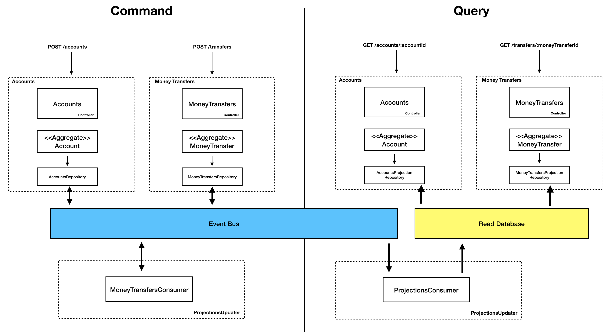
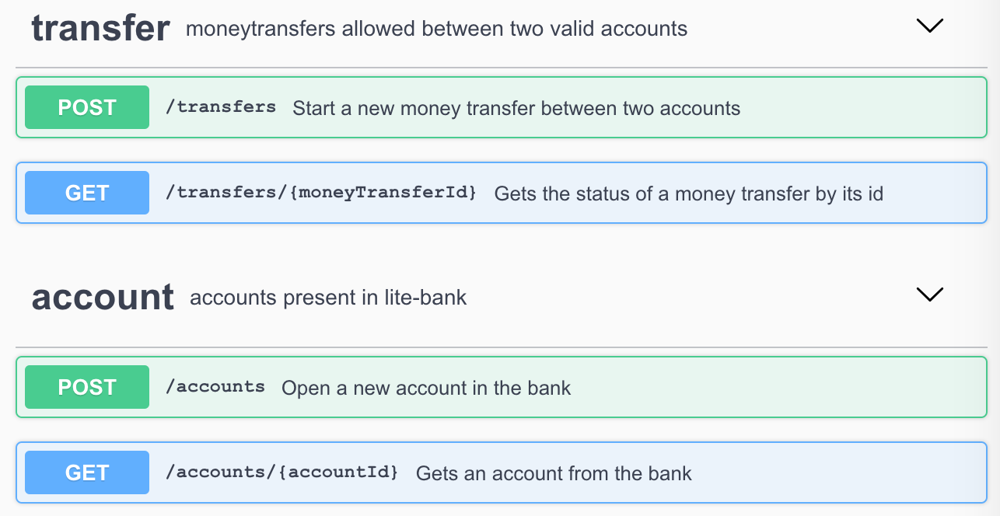
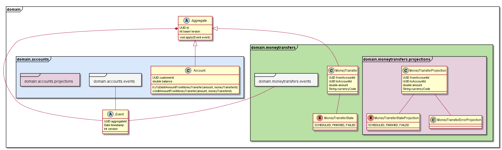
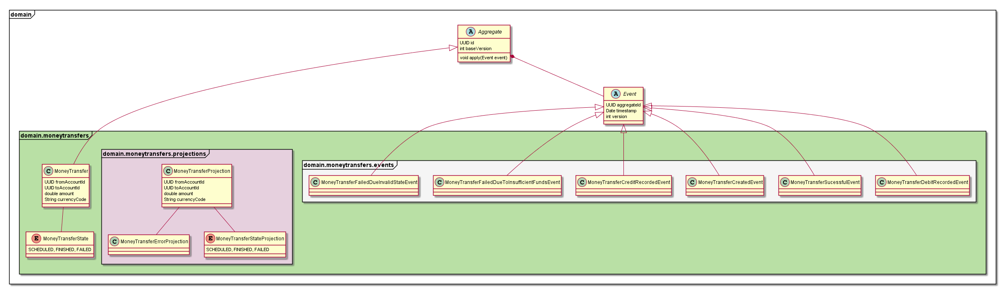
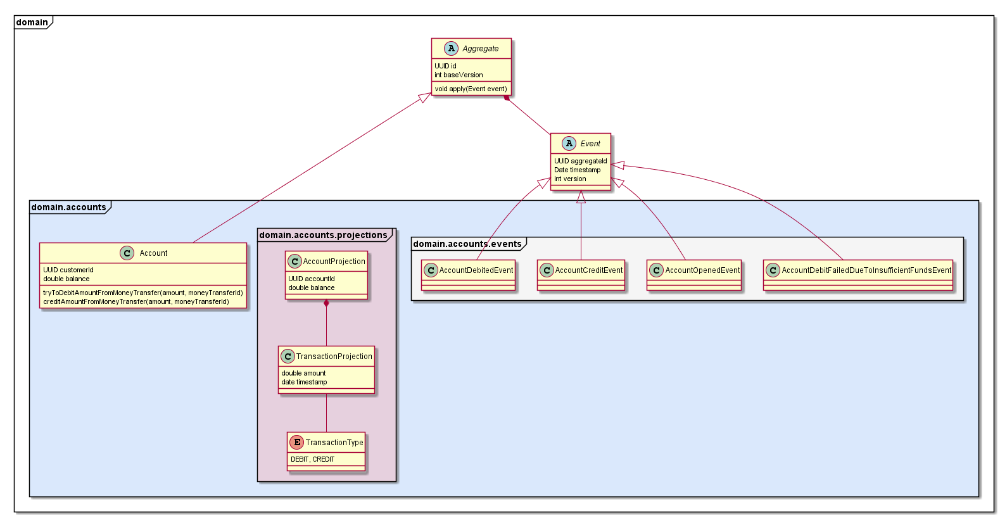

# lite-bank: A lite traceable, scalable and well though bank
This project builds a bank with account opening and get operations and with money transfer operations.

To achieve this a system built with CQRS pattern along with EventSourcing to allow the traceability, scalability, transactional problems.

## Decision log

Next comes the decision log written when the implementation started:

```
General Requirements:
- The application actions should be traceable
- The application should be high availability
- The designed solution should be scalable and should - allow a high read throughput
- The solution should take concurrency as a natural condition and react to prevent possible problems coming from that nature
- Service should be invoked by other applications

Domain Requirements:
- Minimum transferable amount: 0 (non-inclusive)
- Maximum transferable amount: not established 
- Transfers should only occur between two existing accounts
- A transfer can only be successful if the sender has enough funds to transfer the amount to the other account.
- An user cannot transfer money to itself

Decisions:
- Due to the need of traceability of the application and handling of a high volume of reads the architecture chosen for the application was the CQRS pattern.
- As repositories they were though as separated repositories, event bus (event store) when executing commands, performing the money transfers, and updating the projections and other type of repository to store and read the projections.
- By following this approach the solution is async by conception and the clients should deal with this behavior.
- When creating a money transfer, if no parameters violate the creation flow, the transfer is accepted. This allows the clients to then ask the server for the status of the transfer.
- The transfer will occur by a series of events, that are detected and provoque other events.
- When a conclusion is reached, the projection is updated and the client will get its state
- Concurrency is addressed with events. This stream of events allow to serialize the values of the entities, and to retrieve and aply them properly.
- Due to the operations implemented only two bounding contexts were identified: Account and MoneyTransfer.
- As the application should be called by other applications, a java client was developed to allow these applications to easily integrate with our service. Other clients were left as future work.
- All the code should be testable, and therefore interfaces were used to allow the IoC and better testability of the software.
- A custom DI was made just because adding another framework would be overkill for the sake of the project. This can be later easily changed.


Considerations:
- Currently it does not exists the possibility of closing an account. If such requirement is added then some designs should be discussed to make clear what should happen in edges situations (rollback of a transfer to a now-closed account for example)
- Although a highest limit was not defined for the amount to be transfered, the application supports a high value, that can be later refined with some domain requirements (per user, in a timeframe, etc.)
- Currently it is being used an optimistic lock when adding results to the event store. This could be later fined tuned to the better approach for the problem.
- More clients in different languages should be implemented, this allow the service developers to implement tools to help dealing with the service (cache, circuit breakers, etc.).
```

## High-level architecture

An overview of the system's high-level architecture is depicted next.

#### lite-bank high-level architecture


## REST API

The system exposes an REST API. To better document this REST API it was written an api specification using the Open Api Specification present in [open-api-specification.yml](docs/open-api-specification.yml) and depicted next:

#### lite-bank api swagger


## Class Diagram

During the projects conception phase an class diagram was ellaborated to help identify the components that make part of the solution.

This diagram was then refined with new findings and new pieces.

Next come the general packages class diagram, with the detailed ones following.

#### Packages class diagram



#### domain.moneytransfers diagram



#### domain.accounts diagram



## Application Client
As the application should be consumed by other services, it was also implemented a java client. Later more clienters (Kotlin for example) could be added to fulfil other services needs. These clients allow to better define the policies that should be used to contact our service (caching, circuit breakers, etc.).

## Unit Tests and Integration Tests

The application code is covered with unit tests.
All the parts were implemented with interfaces allowing for better testing.

There also exists integration tests that run the application and run common use cases to validate its behavior.

## Build

To build the application run
```
./gradlew shadowJar
```

This command generates a jar of the lite-bank application. To run it do:

```
java -jar build/libs/lite-bank-0.0.1-all.jar
```

## Docker

Even though the application can be ran using one single jar, it also exists a [Dockerfile](docker/Dockerfile) specifying the configurations to run the application inside a Docker container and a bash script `builddocker.sh` that builds the image of the container.

## Frameworks and language
This project was developed using JDK 11. The following frameworks were used:

- Javalin - A simple web framework
for Java and Kotlin
- Gradle - As java package manager
- JUnit 4 - As a unit test framework
- Mockito - As a mocking framework
- slf4j - As a logging framework
- jackson - As a json serializer/deserializer
